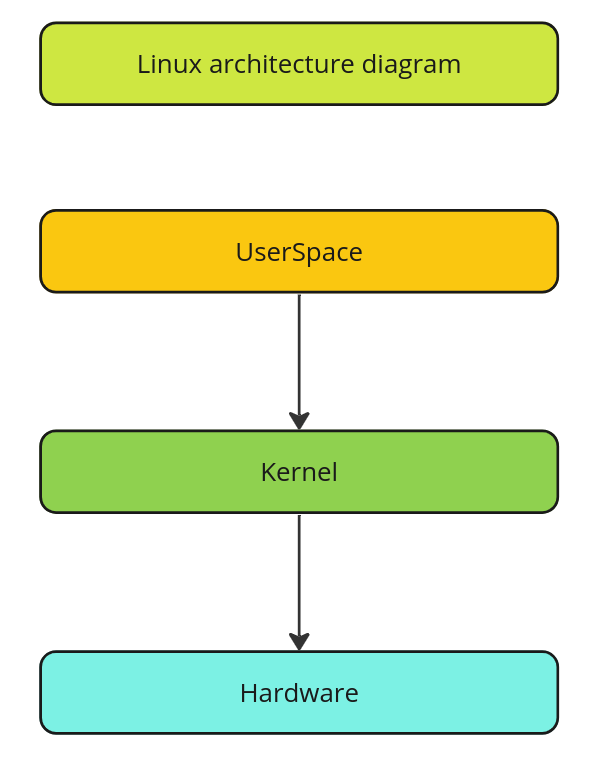
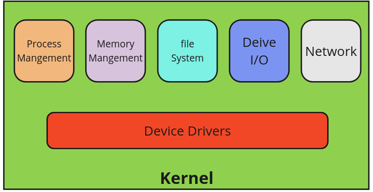
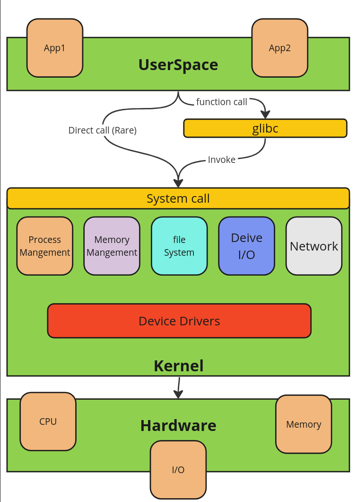

<h1> Task1 </h1>

1. **What does "kernel" mean?**
   - The kernel is the core component of an operating system. It manages the system's resources, such as CPU, memory, and peripheral devices. It provides essential services for other parts of the operating system and user applications.

2. **What does "Operating System" mean?**
   - An operating system is software that manages computer hardware and provides a platform for running applications. It includes a kernel, system utilities, device drivers, and other software components necessary for computer operation (Kernel + Applications).

3. **Is Linux a kernel or operating system?**
   - Linux is a kernel. The complete operating system is often referred to as "GNU/Linux," where Linux is the kernel, and GNU provides the additional components to create a fully functional operating system.

4. **What is an Architecture Layer Diagram?** 
   - An Architecture Layer Diagram is a visual representation that illustrates the different layers of a software system or architecture and how they interact with each other. It helps in understanding the system's structure and dependencies.

    

    
    

    
   - We can divide them into 

        - UserSpace
        - Kernel
        - Hardware
  
7. **Describe Main Layers for Linux kernel.**
   - The main layers of the Linux kernel are:
     1. **Device Driver**
     2. **Process Management**
     3. **Memory Management**
     4. **Filesystem**
     5. **Networking**
    

    
    

8. **Identify the Purpose for each Layer.**
   - Each layer serves specific functions:
     - Device Driver: Provides hardware abstraction for portability.
     - Process Management: Manages processes and threads for multitasking.
     - Memory Management: Allocates and manages memory resources.
     - Filesystem: Manages storage and provides access to files.
     - Networking: Handles communication over networks.

9. **Identify how each layer interacts with the lower one.**
   - The user Space interacts with kernel through System call using glibc library, then calling the specific stack inside kernel and interact with hardware through device drivers as abstraction layer for hardware. 
    

    
    

10. **What is Glibc Library?**
    - The GNU C Library (glibc) is a library of C programming functions used by most GNU/Linux distributions. It provides essential APIs for system calls, memory management, input/output operations, and other common functionalities.

11. **What does "command" mean?**
    - A command is an instruction given to a computer program to perform a specific task. It can be issued through a command-line interface (CLI) or a graphical user interface (GUI).

12. **Describe command in terms of the following:**
    - **Name**: The name of the command, such as "ls" for listing directory contents.
    - **Location**: The location of the command executable file in the file system. Using **which** to know the location of command
    - **Version**: The version of the command, which can be obtained using command-specific options like "--version" or "-v".
    - **Input**: Any input parameters or arguments required by the command to execute.
    - **Output**: The result or output produced by the command after execution.

