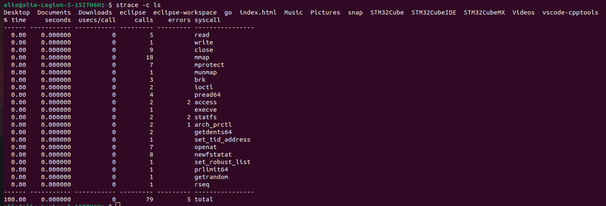

<h1> Task2 </h1>

1. **Trace system call for for [ps, cd and ls]**
   - ps command used to display information for the active processes 

   - Use command strace ps to know all syscall information.

   - Use command strace -c ps (To know time and syscall function)
   

    
    

   - ls command used to show the content of the folder 

   - use cmmand strace -c ls 
   

    
    

   - cd command used to change directory to specific path

   - The cd command is a shell built-in and does not create system calls in the same way as external commands like ps or ls. Therefore, you cannot use strace directly with cd.

   - we Can use with strace -c bash -c 'cd /path'

      - use cmmand strace -c ls 
   

    
    

