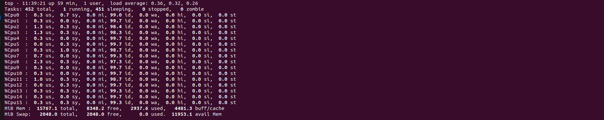
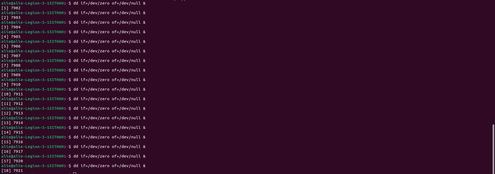
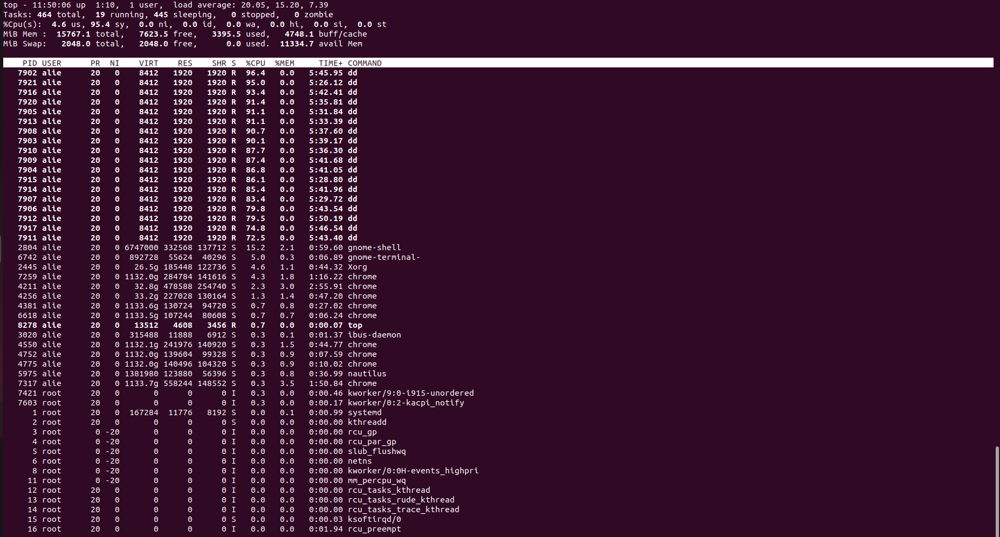
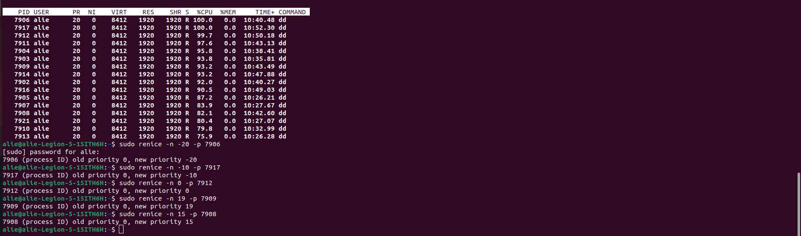
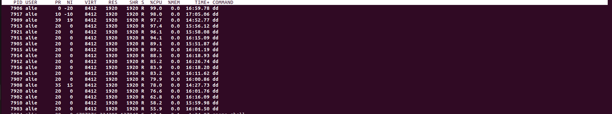
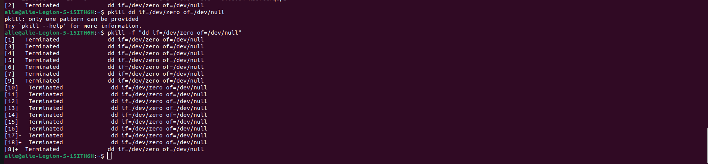

<h1> Task3 </h1>

1. **Check how many cores do you have.**
   - write top command then press no.1 

   - There are 16 cores 
   

    
    

2. **Create number of cores + 2 processes dd if=/dev/zero of=/dev/null run in background.**
   

    
    

3. **Change priority for them: -20, -10, 0, .. , 19**

   - tasks before change prioirties
   

    
    

  
   - Change prioirties
   

    
    

   - tasks after changing the priorities
   

    
    

4. **Kill them all using killall command.**
   

    
    

   

