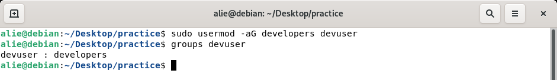

<h1> Task4 </h1>

1. **Exercise: Basic Navigation**
   - Use ls to list all files and directories in the current directory.
   - Use cd to navigate to a specific directory 
   - Use pwd to print the current working directory.

   

    
    

2. **Exercise: File and Directory Operations.**
   

    
    

3. **Exercise: File Viewing and Editing**
   

    
    

  
4. **Exercise: File Permissions**
   

    
    

5. **Exercise: User and Group Management**
   

    
    

6. **Exercise: Process Management**
   

    
    

    

    
    

7. **Exercise: File Searching**
   

    
    

8. **Exercise: Archiving and Compression**
   

    
    

9. **Exercise: Networking**
   

    
    

   

    
    

10. **Exercise: Package Management**
   

    
    

11. **Text Processing**
   

   
   

