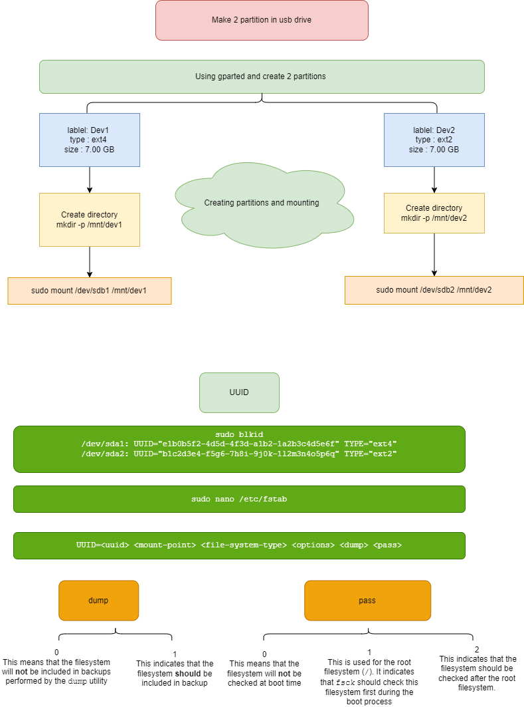
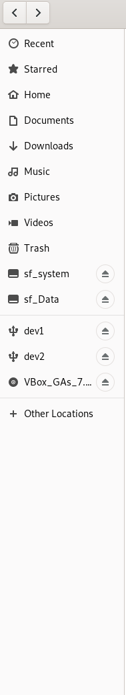

<h1> Task4 </h1>

1. **Exercise: Task B filesystems**
   - Make at least two partitions on your SD-CARD using gparted.
   - Create for each partitions filesystem ( first one ext4 & second one ext2 ).
   - Mount two partitions on your root filesystem.
   - Add some files inside each one.
   - reboot your machine.
   - check if mounting points still exists, it should not.
   - Make the ext4 persistance by adding /etc/fstab file ----> (search how you can do that).
   - reboot your system.
   - Check if the ext4 is mounted.

   

    
    

   At the left there are two partitions dev 1 and dev 2.
   

    
    

